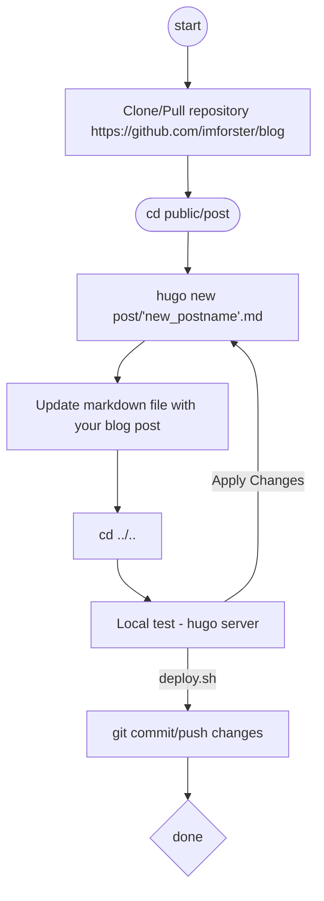

## How to add a blog post

```mermaid
flowchart TD
    s((start)) --> A
    A[Clone/Pull repository https://github.com/imforster/blog] --> B([cd public/post])
    B --> C[hugo new post/'new_postname'.md]
    C --> D[Update markdown file with your blog post]
    D --> E[cd ../..]
    E --> F[Local test - hugo server]
    F -- Apply Changes --> C
    F -- deploy.sh --> G[git commit/push changes]
    G --> H{done};
```
